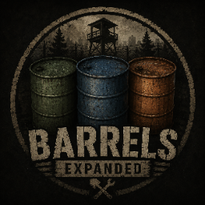

# Barrels Expanded [MP + SP]

> A Project Zomboid Build 42 mod that turns world barrels into useful survival resources with randomized contents, persistent state, and interactive gameplay for singleplayer and multiplayer.

---

## Why was it created?

Project Zomboid's world is packed with industrial and military barrels, but most of them are just scenery. You can walk past them, build around them, or ignore them, but they rarely matter.

**Barrels Expanded** changes that. Barrels can become emergency water, fuel reserves, cleaning supplies, or empty containers waiting to be used at your base. You do not know what is inside until you open one.

The goal is to make exploration more rewarding without turning the game into something else.

---

## What does it do?

The mod adds interactive behavior to existing vanilla world barrels. You can:

- Open and inspect barrels.
- Drink from water barrels when the liquid is drinkable.
- Wash yourself, clothing, and washable items with barrel water.
- Pour compatible liquids into barrels.
- Fill compatible containers from barrels.
- Move liquid directly between nearby opened barrels.
- Refuel nearby generators from gasoline barrels through the Barrel menu or the generator Add Fuel menu.
- Empty barrels progressively when you want to clean them out or change their contents.
- Pick up, move, and place opened barrels while preserving their contents and weight.

Barrel contents are revealed the first time a barrel is opened:

- Liquid type: Water, Tainted Water, Gasoline, Bleach, or Empty.
- Amount: between 1 and 160 units when liquid is present.

Once generated, barrel state is saved in the world and shared in multiplayer.

---

## Existing Features

1. **Open barrel** with one required tool: Crowbar, Forged Crowbar, Screwdriver, Pipe Wrench, or Sheet Metal Snips.
2. **Inspect barrel info** through the Barrel context menu: liquid type, fill level, requirements, item icons, and disabled reasons.
3. **Drink from barrel** when it contains Water or Tainted Water.
4. **Wash from barrel**:
   - Wash your character.
   - Wash clothing and washable inventory items.
   - Clean compatible bandage-like items when the water is safe.
   - Soap is optional, but affects wash speed/cleaning behavior.
5. **Pour into barrel** from compatible inventory containers, requiring a Funnel.
6. **Fill containers from barrel** using compatible inventory containers, requiring a Rubber Hose.
7. **Barrel-to-barrel transfer** between nearby opened barrels.
8. **Generator refueling** from nearby gasoline barrels through the Barrel menu or the generator Add Fuel menu, requiring a Rubber Hose when hose requirements are enabled.
9. **Fill all / grouped fill menu** with vanilla-style container grouping.
10. **Progressive emptying** that drains liquid during the timed action; interrupted actions keep the amount already drained.
11. **Randomized first-open content** based on barrel tile category.
12. **Sandbox tuning** for capacity, empty weight, interaction distance, opening tools, transfer tool requirements, and liquid spawn weights by barrel type.
13. **Persistent barrel state** that survives saves, reloads, pickup/place, and server restarts.
14. **Server-safe multiplayer behavior** with protection against overlapping use of the same barrel.
15. **Dynamic barrel weight** based on liquid type and amount.
16. **Singleplayer and multiplayer support**.
17. **Optional mod compatibility** for DamnLib/USMIL military gas and water cans in barrel liquid transfers.
18. **Current translations**: English, Spanish, and Argentinian Spanish.

### Gameplay Data

| Category | Current State |
|---|---|
| Liquid types | Water, Tainted Water, Gasoline, Bleach, Empty |
| Barrel capacity | 160 units |
| Drink amount | 0.12 units per drink action |
| Wash unit cost | 1 unit per washed body/item segment |
| Supported barrel tiles | Industrial, military, and crafted barrel tiles |
| Transfer tools | Funnel for pouring in, Rubber Hose for filling containers and refueling generators |

---

## Planned Features

These are ideas for future versions, not current features:

- **Water Bidons compatibility**: support filling barrels from the Water Bidons mod containers (Workshop ID: 3628782804, Mod ID: WaterBidon).
- **Rare liquid discoveries**: add uncommon finds such as milk or wine barrels in store buildings.
- **Barrel labels or ownership markers**: easier multiplayer base organization.
- **Water treatment interactions**: gameplay steps for making tainted water safer.
- **Pressurized water transfer**: use a rubber hose to move water from sinks or bathtubs into barrels before the water shuts off, or much more slowly afterward if supported.
- **Rain and snow collectors**: cut open barrel tops with a propane torch and repurpose them as collectors, including snow melting into water.
- **Fuel logistics**: refuel vehicles from gasoline barrels.
- **Fuel station logistics**: pump gasoline from fuel stations directly into barrels.
- **Plumbing-style barrel supply**: feed sinks, bathtubs, and washing machines from nearby or elevated barrels.
- **Barrel condition system**: rust, damage, leaks, contamination, or reliability risks.

---

## Compatibility

- **Game version:** Project Zomboid Build 42
- **Multiplayer:** Supported
- **Singleplayer:** Supported
- **Server-side only:** Not supported; the mod must be enabled on clients too
- **Safe install:** Designed to work with ongoing saves; always back up saves before adding or removing mods

---

## Translations

Current translations:

- English
- Spanish
- Argentinian Spanish

Community translation help is welcome. If you want to help translate Barrels Expanded into another language or improve an existing translation, contributions and suggestions are appreciated.

---

## Installation

1. Subscribe to the mod on Steam Workshop.
2. Enable it from the **Mods** menu in the main menu or when creating a new game.
3. No additional configuration is required.

---

*[Español](README_ES.md)*
